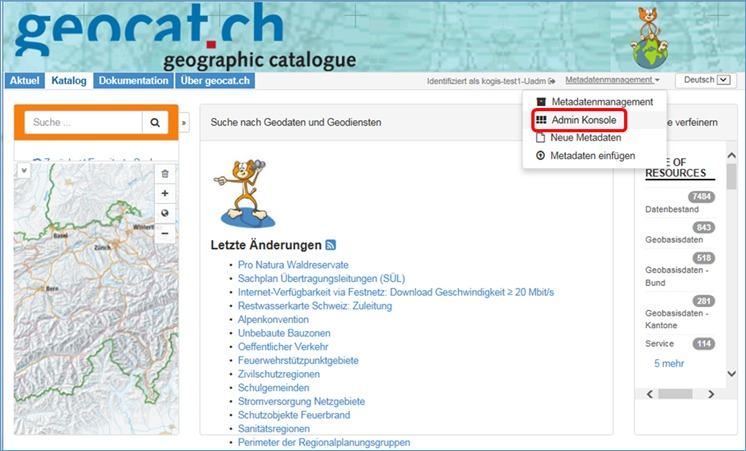
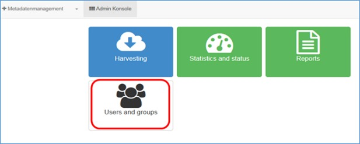
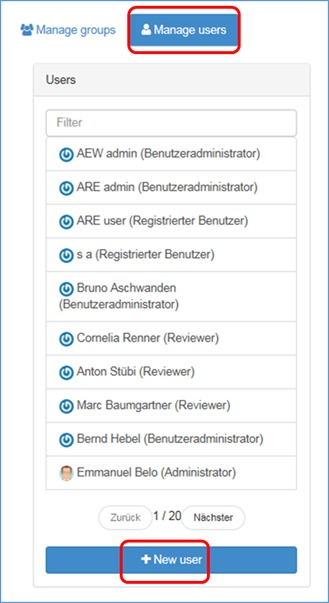
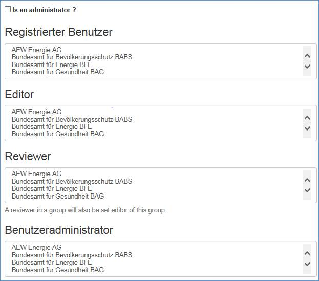
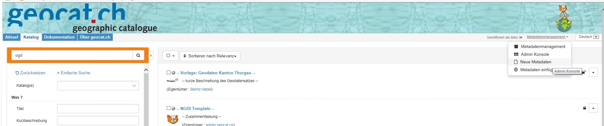
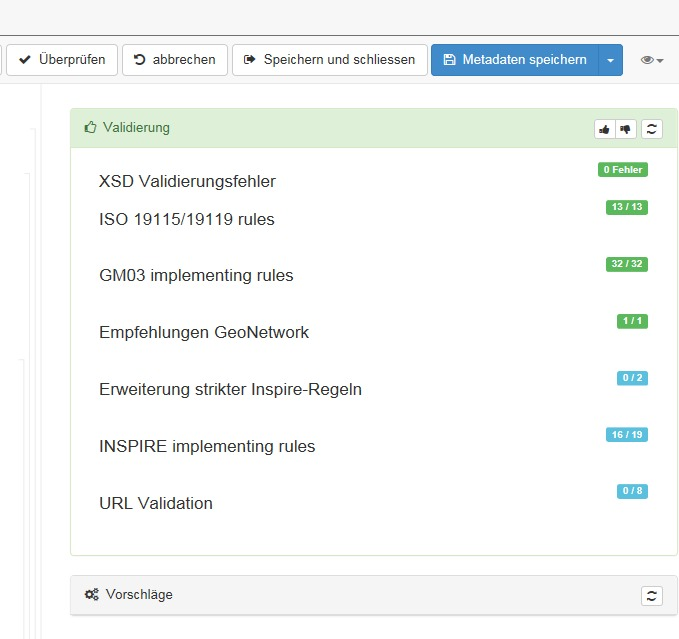
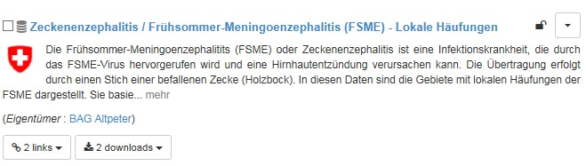
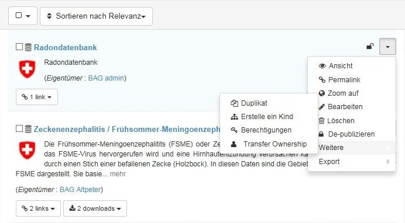

# Publikation direkt auf opendata.swiss

Dafür sind drei Schritte nötig:

1. Vorbereitungen organisatorischer und technischer Art bei Ihnen (Datenlieferant).
2. Upload in den Katalog von opendata.swiss.
3. Live-Schaltung des aktualisierten Katalogs auf opendata.swiss.

[Im Benutzerhandbuch](/de/publish/userguide) ist das System von opendata.swiss ausführlich dokumentiert.

## Vorbereitung

Rollen vergeben:

- Datenbesitzer (oder „Data-Owner“) definieren: Wer ist in Ihrer Organisation verantwortlich für die Daten und deren Publikation?
- Datenlieferant definieren: Wer hat die technische Verantwortung (mögliche Aufgaben: Erfassung von Metadaten, Testing, Aktualisierungen)?
- Definieren wer die Qualität der Beschreibungen und der Metadaten prüft sowie auch wer fachliche/inhaltliche Fragen zu den Datenbeständen beantworten kann.
- Definieren wer der/die SPOC für den Portal-Betreiber sein wird.

Daten und Metadaten vorbereiten:

- Die [Referenz zur gesetzlichen Grundlage](/de/prepare/frameworks) für die Publikation verifizieren.
- Auswahl der [korrekten Nutzungsbedingung](/de/prepare/terms) verifizieren.
- Prüfen in welchem Format diese Datensätze publiziert werden.

> ### Empfehlungen Dateiformate

> _Grundsätzlich steht es Ihnen frei, in welchem Dateiformat Sie Ihre Daten auf opendata.swiss zur Verfügung stellen wollen. Das Bundesarchiv empfiehlt jedoch, sich an die im Dokument [Empfehlung Dateiformate](/de/library/empfehlungen-formate) angegebenen Formate zu halten._

- Falls nötig, Qualitätssicherung der Daten durchführen

## Metadaten-Import durchführen

Damit Sie die Metadaten auf opendata.swiss erfassen können, muss das Bundesarchiv Ihre Organisation im System erstellen. [Melden Sie sich](mailto:opendata@bar.admin.ch), falls ihre Organisation bisher noch keine Daten auf dem Portal publiziert. Anschliessend sind insbesondere folgende Punkte zu beachten:

- Machen Sie sich mit der Benutzeroberfläche bzw. den DCAT-AP Felder vertraut. Ausführliche Informationen zum System liefert [das Benutzerhandbuch von opendata.swiss](/de/publish/userguide).
- Erfassen Sie die Metadaten. Dafür sind die im [DCAT-AP Standard](/de/library/ch-dcat-ap) definierte Felder auszufüllen (hier ist die ausgewählte [Publikationsvariante](/de/publish/options) massgebend).
- Schicken Sie uns ein Bild und eine Beschreibung Ihrer Organisation, wenn möglich bereits 4-sprachig (DE, FR, IT, EN). Beides wird auf Ihrer Organisationsseite aufgeschaltet ([zum Beispiel](https://opendata.swiss/de/organization/schweizerisches-bundesarchiv-bar)).

## Live-Schaltung

Das Bundesarchiv und der Datenlieferant stellen gemeinsam sicher, dass alle Daten, Metadaten und Beschreibungen in der Test-Umgebung korrekt dargestellt werden.

Nachdem Sie Ihr Einverständnis gegeben haben, schaltet das Bundesarchiv die Daten online.

# Publikation von Geodaten

Im Folgenden ist das Vorgehen beschrieben, wie valide Datensätze in geocat.ch erstellt werden, um sie anschliessend auf dem opendata-Portal zu publizieren.

Um Geodaten auf dem Portal [opendata.swiss](https://opendata.swiss/) zu publizieren, müssen die Metadaten der betroffenen Daten zuerst im Katalog für Geometadaten [geocat.ch](http://www.geocat.ch) publiziert werden. Von dort werden die benötigten Attribute dann durch einen automatisierten Prozess ins opendata-Portal überführt.

## 1. Anmeldung bei geocat.ch

Um auf geocat Metadaten zu publizieren, müssen zwei Kriterien erfüllt sein, die der Benutzer nicht selber einrichten kann, und die er somit durch die Administratoren von geocat.ch beantragen muss:

**Gruppe**, welche für die zu publizierenden Daten zuständig ist (z. Bsp. ein Kanton, ein Bundesamt etc.)

- Falls die Gruppe noch nicht in geocat.ch besteht, bitte Angaben zur Gruppe (genauer Name in den drei Landessprachen und Englisch, sowie ein Logo) per Mail an [geocat@swisstopo.ch](mailto:geocat@swisstopo.ch) schicken.

**Benutzerkonto**

Um dies einzurichten, bitte eine E-Mail an [geocat@swisstopo.ch](mailto:geocat@swisstopo.ch) senden und Kontaktangaben zur Person (Name, Vorname und E-Mail) nennen. Für jede Gruppe wird durch die Administratoren von geocat.ch ein Konto eingerichtet, welches die Rechte eines „Benutzeradministrators“ hat. Diese Rolle berechtigt dazu, selber neue Benutzerkonten in der eigenen Gruppe einzurichten.

Ein Benutzeradmin kann wie folgt Benutzer einrichten:

1) Einloggen und unter „Metadatenmanagement“ auf „Admin Konsole“ klicken:

2) Auf der folgenden Seite „Users and groups“ anklicken:

3) Im folgenden Fenster „Manage users“, anschliessend „+ New user“ anklicken:

Anschliessend müssen die Rechte zugeordnet werden.

Folgende Benutzertypen bestehen in geocat.ch:

- „Registrierter Benutzer“: Benutzer kann Metadaten nicht bearbeiten/löschen, aber alle Metadaten der eigenen Gruppen sehen, auch die nicht publizierten
- „Editor“: Benutzer kann Metadaten der Gruppe bearbeiten, löschen, neu erstellen, jedoch nicht publizieren
- „Reviewer“: Benutzer kann Metadaten der Gruppe bearbeiten, löschen, neu erstellen und publizieren
- „Benutzeradministrator“: Benutzer kann neue Benutzerkontos einrichten und ist unsere Ansprechperson für betroffene Gruppe

*„Is an administrator“ bitte nicht anwählen.*

Sobald diese beiden Voraussetzungen erfüllt sind, kann der eingeloggte Benutzer selbständig Metadaten erfassen.

## 2. Gibt es schon ein Metadatensatz in geocat.ch oder nicht?

**JA:** In vielen Fällen besteht bereits ein Metadatensatz in geocat.ch. Dieser muss einfach noch um die OGD-spezifischen Attribute angereichert werden. In diesem Fall bitte gleich zu Punkt 3 weitergehen.

**NEIN:** Besteht noch kein Metadatensatz, muss dieser neu erfasst werden. Dazu muss der Benutzer eingeloggt sein und auf Metadatenmanagement &gt; „Neue Metadaten“ klicken:

Auf der folgenden Seite „Erstelle einen…“ Datensatz anklicken und das Template „opendata.swiss“ auswählen. Anschliessend müssen (mindestens) die für einen Metadateneintrag obligatorischen Elemente ausgefüllt werden, plus zusätzlich die in Punkt 3 beschriebenen OGD-spezifischen Attribute.

Obligatorisch für einen validen Metadatensatz gemäss ISO-Standard sind:

- Titel
- Datumsangabe
- Sprache
- Kurzbeschreibung
- Thematik (Kategorie)
- Ausdehnung
- Metadatenkontakt

## 3. Ein Datensatz, der auf dem OGD-Portal publiziert wird, muss folgende Attribute enthalten:

<table><tr><th>
Name Attribut in geocat.ch
</th><th>
Bemerkungen
</th></tr>
<tr><th>
Metadatensatzidentifikator
</th><td>
wird automatisch generiert
</td></tr>
<tr><th>
Titel
</th><td>
In deutsch und französisch
</td></tr>
<tr><th>
Alternativtitel
</th><td>
In deutsch und französisch
</td></tr>
<tr><th>
Datum
</th><td>
als Rolle “Publikation” wählen; es können mehrere Daten im Metadatensatz angegeben warden (Rollen: “Erstellung”, „Überarbeitung“, „Publikation“), für die Publikation in OGD wird jedoch nur das zuerst erfasste übernommen.
</td></tr>
<tr><th>
Kontakt für die Ressource
</th><td>
Als Rolle „Publisher“ wählen (korrekt? Im Moment häufig „Verantwortliche Stelle“). Optional können weitere Kontakte erfasst werden.
</td></tr>
<tr><th>
Thematik
</th><td>
Es muss eine Thematik ausgewählt werden. Handelt es sich um einen Geobasisdatensatz, muss dieselbe Thematik vergeben werden wie in der Sammlung der Geobasisdatensätze vorgesehen.
</td></tr>
<tr><th>
Sprache
</th><td>
Sprache, in der die Dokumentation zum Datensatz vorliegen
</td></tr>
<tr><th>
Digitale Transferoption
</th><td>
Es muss ein Link auf eine „landing page“ erstellt werden (= Informationsseite zum Datensatz). Dies geschieht über das Protokoll:
<ul>
<li>Webadresse URL: WWW:LINK-1.0-http--link
</ul>
</td></tr>
<tr><th>
Digitale Transferoption
</th><td>
Es **muss** mindestens eine (es dürfen aber auch mehrere) digitale Transferoption ausgewählt werden mit mindestens einem der folgenden Protokolle:
<ul>
<li>Datei via FTP zum Download: WWW:DOWNLOAD-1.0-ftp—download (Mapping: http..?)
<li>Datei via URL zum Download: WWW:DOWNLOAD-URL
</ul>
Spezialisiertes Geoportal: CHTOPO:specialised-geoportal
<ul>
<li>OGC-Web Map Service: OGC:WMS-http-get-map
<li>OGC-WMS Capabilities Service: OGC:WMS-http-get-capabilities (falls Datensatz in WMS publiziert ist)
<li>OGC-Web Map Tile Service: OGC:WMTS-http-get-capabilities
<li>OGC-Web Feature Service: OGC:WFS-http-get-capabilities
</ul>
</td></tr>
<tr><th>
Schlüsselwörter
</th><td>
opendata.swiss ist obligatorisch (löst das Harvesting des Metadatensatzes aus); weitere Schlüsselwörter sind fakultativ
</td></tr>
<tr><th>
Ausdehnung &gt; zeitliche Ausdehnung
</th><td>
Falls der Datensatz zeitlich begrenzte Gültigkeit aufweist, kann dies über die Zeitliche Ausdehnung erfolten:

Ausdehnung &gt; „Nicht-geographischen Extent hinzufügen“ &gt; zeitliche Ausdehnung &gt; Zeitperiode &gt; Beginn und Endzeitpunkt erfassen
</td></tr>
</table>

## 4. Folgende Attribute **sollten** erfasst sein: : s. Mapping: alles, was optional!

## 5. Metadaten validieren

Um den erstellten Metadatensatz zu validieren, muss dieser im Bearbeitungsmodus geöffnet werden. In der Menüzeile auf „Überprüfen“ klicken. Gibt es keine Fehlermeldung betreffend…

- XST
- ISO 19115
- GM03
- GeoNetwork

…so ist der Metadatensatz valide. Ansonsten müssen angezeigte Fehler korrigiert werden.

## 6. Metadaten publizieren

Ob ein Datensatz in geocat.ch publiziert ist, kann an dem kleinen Schloss abgelesen werden. Ist es offen, ist der Datensatz publiziert.

Um einen Datensatz zu publizieren, entweder…

* auf das geschlossene Schloss klicken, oder…

* den kleinen Menüpfeil anwählen, dort „weitere“ und anschliessend „Berechtigungen“ anklicken:

Anschliessend den Datensatz für „alle“ freigeben.

## 7. Anfrage machen für ein CSW-Endpoint

[geocat@swisstopo.ch](mailto:geocat@swisstopo.ch)

## 8. Anfrage machen, dass der CSW-Endpoint geharvestet sein soll

[@opendata.swiss](mailto:opendata@bar.admin.ch)
